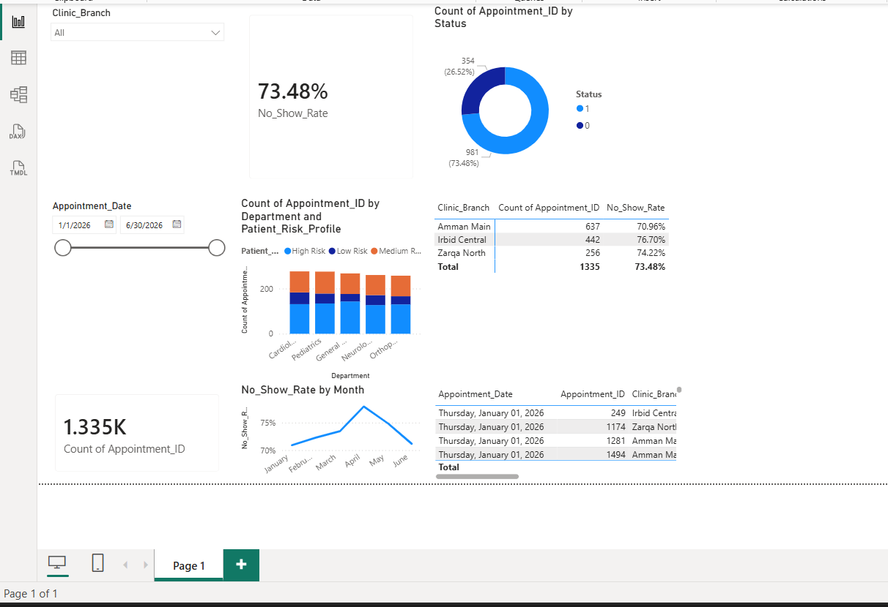

# MyHakeem Healthcare Organization
### Data Science & Business Intelligence Analysis

**Ibrahim Abu Kobe**

---

## Table of Contents

- [Project Overview](#-project-overview)
- [Dashboard Preview](#-dashboard-preview)
- [Activities](#-activities)
  - [Activity 1 - Business Process and Data Analysis](#activity-1---business-process-and-data-analysis)
  - [Activity 2 - Data Science Solution Design](#activity-2---data-science-solution-design)
- [Key Findings](#-key-findings)
- [Tools and Technologies](#-tools-and-technologies)
- [Data Threats and Mitigations](#-data-threats-and-mitigations)
- [Recommendations](#-recommendations)
- [References](#-references)

---

## Project Overview

**MyHakeem** is a web and mobile service created by **Electronic Health Solutions** in partnership with the **Jordanian Ministry of Health** and the **Royal Medical Services**. It allows users to securely access their electronic health records from any healthcare institution that uses the Hakeem program, anytime and anywhere.

This project was completed as part of a university Data Science course at **HTU (Al-Hussein Technical University)**. It delivers a full **data science and business intelligence analysis** of MyHakeem's real-world appointment scheduling operations across three clinic branches in Jordan.

### What This Project Covers

- Identifying and evaluating MyHakeem's core **business processes** and how data powers them
- Analyzing the **social, legal, and ethical implications** of using patient health data
- Assessing **data threats** (privilege escalation, MitM attacks, phishing) and mitigation strategies
- Building an interactive **Power BI dashboard** to visualize a 73.48% network-wide no-show rate
- Designing a full **data science pipeline** using classification ML models to predict patient no-shows
- Proposing **three data-driven recommendations** to reduce no-shows and optimize clinic operations

### Project Snapshot

| Detail | Info |
|---|---|
| **Organization** | MyHakeem / Electronic Health Solutions |
| **Domain** | Digital Healthcare - Jordan |
| **Dataset** | 1,335 appointments across 3 clinic branches |
| **Analysis Period** | January 2026 - June 2026 |
| **Core Problem** | 73.48% patient no-show rate |
| **Primary BI Tool** | Microsoft Power BI |
| **Course** | Data Science - HTU |
| **Student** | Ibrahim Abu Kobe - 24120014 |

---

## Dashboard Preview

*Interactive Power BI dashboard showing no-show rates by branch, department, risk profile, and month.*

### Dashboard Highlights

| KPI | Value |
|---|---|
| **Total Appointments** | 1,335 |
| **Overall No-Show Rate** | 73.48% (981 appointments) |
| **Amman Main No-Show Rate** | 70.96% (637 appointments) |
| **Irbid Central No-Show Rate** | 76.70% (442 appointments) - highest |
| **Zarqa North No-Show Rate** | 74.22% (256 appointments) |
| **Peak No-Show Month** | April (above 75%) |

---

## Activities

### Activity 1 - Business Process and Data Analysis

> Defines MyHakeem's core business processes, data types, collection methods, and assesses social, legal, and ethical implications.

#### 1.1 Business Processes Analyzed

| # | Process | Patient Benefit | Organizational Benefit |
|---|---|---|---|
| 1 | **Prescription Refill and Delivery** | Eliminates in-person pharmacy queues | Reduces front-desk load and streamlines fulfillment |
| 2 | **Clinical Results Access (Lab/Radiology)** | Instant access to personal health records | Reduces call center load and frees physician time |

#### 1.2 Data Types Used

| Type | Examples |
|---|---|
| **Structured Data** | Patient ages, National IDs, medication dosages, timestamps |
| **Semi-structured Data** | Tagged records, EHR metadata, system logs |
| **Unstructured Data** | Doctor's clinical notes, MRI scans, audio consultations |

#### 1.3 Data Collection Methods

- **Active Generation** - Patient-entered data (registration, delivery address, appointment booking)
- **Passive/Automated Generation** - System logs (login timestamps, record access events)
- **System Integration** - Medical devices and lab systems pushing structured results to the central EHR

---

### Activity 2 - Data Science Solution Design

> Designs and evaluates a full data science pipeline to solve MyHakeem's no-show problem using classification modeling and Power BI dashboards.

#### 2.1 Solution Pipeline

| Phase | Step | Description |
|---|---|---|
| **Phase 1 - Intelligence** | 1.1 Define Business Problem | Identify the 73.48% no-show rate as the core operational bottleneck |
| **Phase 1 - Intelligence** | 1.2 Collect Historical Data | Extract scheduling logs including branch, department, age, and status |
| **Phase 2 - Design** | 2.1 Data Cleaning | Standardize text, remove nulls, filter anomalies using Power Query |
| **Phase 2 - Design** | 2.2 Feature Engineering | Create calculated fields such as Previous_No_Shows per patient |
| **Phase 2 - Design** | 2.3 AutoML Training | Train classification models via Microsoft Fabric |
| **Phase 3 - Deployment** | 3.1 Deploy Model | Push trained model into production via Microsoft Fabric |
| **Phase 3 - Deployment** | 3.2 Integrate into Power BI | Visualize risk profiles and KPIs on the live dashboard |
| **Phase 3 - Deployment** | 3.3 Activate SMS Alerts | Trigger automated confirmations based on risk label |

#### 2.2 Classification Output - Patient Risk Profiles

| Risk Label | Description | Recommended Action |
|---|---|---|
| **High Risk** | Strong historical pattern of no-shows | Manual phone call + mandatory SMS confirmation |
| **Medium Risk** | Moderate probability of absence | Automated 48-hour SMS reminder |
| **Low Risk** | Reliable attendance history | Standard confirmation only |

#### 2.3 Problems Solved

**Problem 1 - High Patient No-Show Rate**
- **Approach:** Predictive Analytics using Classification Algorithms
- **Inputs:** Patient age, travel distance, past attendance, branch, department, time-of-day
- **Output:** No-Show Probability Score per appointment
- **Impact:** Enables safe overbooking of high-risk slots and activates targeted reminders

**Problem 2 - Unauthorized Access and Insider Threats**
- **Approach:** Anomaly Detection using Unsupervised Machine Learning
- **Baseline:** Normal login times, typical IP addresses, average records accessed per session
- **Output:** Instant flag if any deviation from baseline is detected
- **Impact:** Proactive SOC alerts, reduced incident response time, clean forensic logs

---

## Key Findings

| Finding | Detail |
|---|---|
| Overall no-show rate | 73.48% of all 1,335 appointments were no-shows |
| Worst performing branch | Irbid Central at 76.70% |
| Peak no-show month | April (exceeds 75%) |
| Best performing branch | Amman Main at 70.96% despite highest volume (637 appointments) |
| Risk distribution | High Risk patients appear consistently across all 5 departments |

---

## Tools and Technologies

| Tool | Role in Project |
|---|---|
| **Microsoft Power BI** | Dashboard creation, KPI visualization, interactive filtering |
| **Power Query (M Language)** | Data cleaning - standardizing text, removing nulls, filtering anomalies |
| **DAX (Data Analysis Expressions)** | Calculated measures for No_Show_Rate and Patient_Risk_Profile |
| **Python (Pandas / Scikit-learn)** | Predictive modeling and classification algorithms |
| **SQL** | Extracting targeted patient cohorts from EHR relational databases |
| **Microsoft Fabric (AutoML)** | Training and evaluating classification models at scale |

---

## Data Threats and Mitigations

| Threat | Description | Organizational Mitigation | Personal Mitigation |
|---|---|---|---|
| **Privilege Escalation** | Insider or attacker accessing unauthorized records | Strict Role-Based Access Control (RBAC) | Strong unique passwords and never share credentials |
| **Man-in-the-Middle** | Network traffic intercepted during data transmission | Enforce TLS/HTTPS on all app and web portal traffic | Avoid MyHakeem on public or unsecured Wi-Fi |
| **Phishing** | Staff tricked into revealing credentials via fake portals | Security awareness training and advanced email filtering | Verify sender domain before clicking any MyHakeem links |

---

## Recommendations

### Recommendation 1 - Risk-Based Scheduling
Deploy the classification model output directly into the scheduling interface. Receptionists see a color-coded risk label per appointment and trigger the appropriate protocol (call, SMS, or no action) without needing any technical knowledge.

### Recommendation 2 - Enforce Two-Way Confirmations During Seasonal Peaks
The no-show rate spikes from February through April. During these months, implement mandatory 48-hour two-way SMS confirmations. If a patient does not respond to confirm, the system automatically cancels the slot and opens it to waitlisted patients.

### Recommendation 3 - Reallocate Admin Resources by Branch Performance
- **Irbid Central** (76.70%, mid volume) - Direct human staff to perform manual phone-call follow-ups
- **Amman Main** (70.96%, highest volume) - Handle almost entirely via automated digital systems

This ensures human intervention is deployed exactly where the data shows it is most needed.

---

## Impact Analysis

### Social Impact

| Process | Positive | Negative |
|---|---|---|
| Prescription Refill | Helps elderly patients adhere to medication plans | Removes in-person pharmacist safety checks |
| Clinical Results Access | Empowers patient health literacy | May cause anxiety before a doctor explains results |

### Legal Impact

| Process | Positive | Negative |
|---|---|---|
| Prescription Refill | Creates a perfect digital audit trail | Liability gaps if delivery of controlled substances fails |
| Clinical Results Access | Upholds patient legal right to their own records | Data mix-ups between patients carry serious legal risk |

### Ethical Considerations

- Automated risk-scoring applies the same mathematical rules equally to all patients
- However, the algorithm cannot distinguish between a forgetful patient and one who missed due to transportation poverty, risking systematic penalization of vulnerable groups

---

## References

1. Electronic Health Solutions (n.d.) MyHakeem. https://my.hakeem.jo
2. IBM (2025). Privilege Escalation. https://www.ibm.com/think/topics/privilege-escalation
3. Lindemulder, G. and Kosinski, M. (2024). Man-in-the-Middle Attack. https://www.ibm.com/think/topics/man-in-the-middle
4. Kosinski, M. (2024). What is Phishing? https://www.ibm.com/think/topics/phishing
5. McKinney, W. (2012). Python for Data Analysis. O'Reilly Media.
6. VanderPlas, J. (2016). Python Data Science Handbook. O'Reilly Media.
7. Beaulieu, A. (2020). Learning SQL. O'Reilly Media.
8. Ferrari, A. and Russo, M. (2017). Analyzing Data with Power BI. Microsoft Press.
9. Microsoft (2023). What is Power BI? https://learn.microsoft.com/en-us/power-bi/fundamentals/power-bi-overview

---

**Ibrahim Abu Kobe** - Cybersecurity

